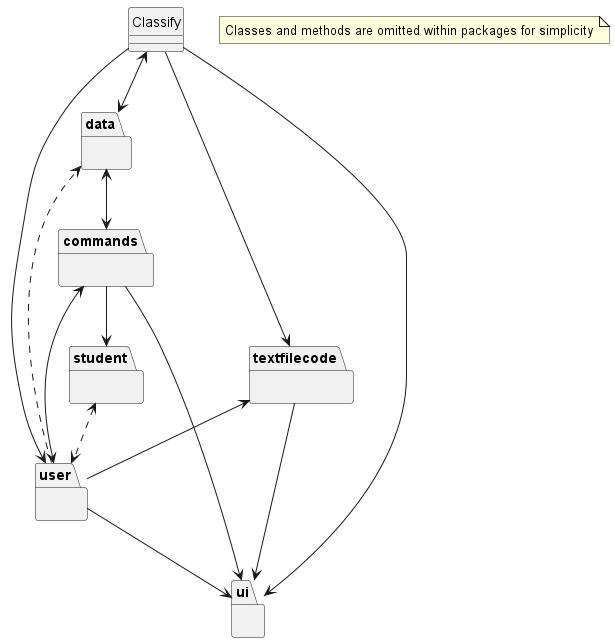
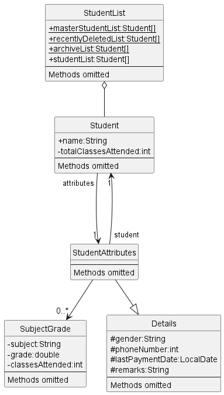
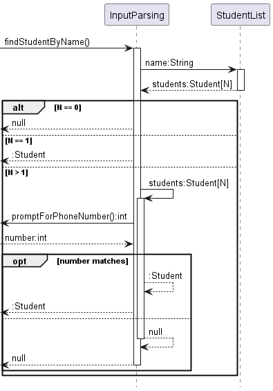
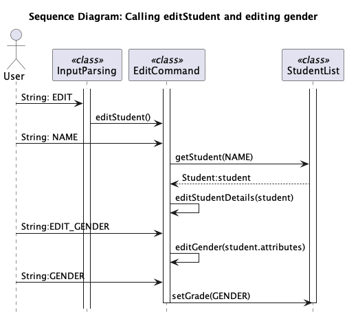
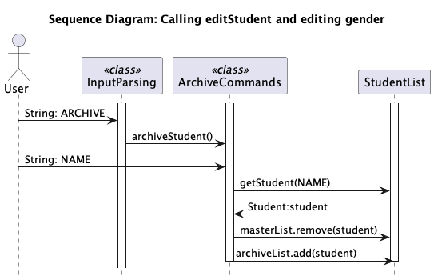

# Developer Guide

## Table of Contents
- [Acknowledgements](#acknowledgements)
- [Overall Design and Implementation](#overall-design-and-implementation)
- [Project Components](#project-components)
   - [UI component](#ui-component)
   - [InputParsing component](#inputparsing-component)
   - [Student Details](#student-details)
   - [AddStudent Component](#addstudent-component)
   - [EditStudent Component](#editstudent-component)
   - [StudentSorter Component](#studentsorter-component)
   - [Data Component](#data-component)
   - [TextFileCode Component](#textfilecode-component)
   - [ArchiveCommands Component](#archivecommands-component)
- [Project Scope](#product-scope)
   - [User Stories](#user-stories)
   - [Non-Functional Requirements](#non-functional-requirements)
   - [Glossary](#glossary)
   - [Instructions for manual testing](#instructions-for-manual-testing)

## Acknowledgements

1. Reference to AB-3 Developer Guide

- [Source](https://se-education.org/addressbook-level3/DeveloperGuide.html#proposed-undoredo-feature)
- Used as template to structure this Developer Guide

## Overall Design and implementation
Main architectural diagram:

Do note that the Classify class is the "main" class in the diagram, with all other packages having their classes omitted for simplicity.

---

## Project Components

### UI component

The `UI` class handles message output for the user within the terminal.
- Stores message output strings for user feedback
- Holds methods for printing messages to be called by other classes, such as `InputParsing`.

#### Design considerations

* Being a CLI application, UI/UX should be minimal and user IO should be confined within the terminal.

* public methods within the `UI` class are static for easy access by other classes, without the need to instantiate an instance of the `UI` class to call.

### InputParsing component

This component ensures that the user parses in commands in a format that makes sense, which will modify the master list.

#### Design considerations
- The parser must be effective in breaking down the user's input into its constituent commands, with further breakdown if an associated argument is added.
- The parser should be quick and effective in understanding the user's input, with simple prompts given to help the user in correctly parsing the command through the input parser.
- Allowing the user to input optional arguments. For example, the user could type `view <student name>`, which takes in the "student name" as an optional argument. This is to increase the robustness of the program, which accounts for the two types of users, one who just types in `view`, and the other as formerly mentioned above. 
- Error handling must be intuitive for the user, so that appropriate error messages are produced if the user does not input a valid command. The error handling should also be robust, to account for the event a user is incapable of following instructions.

#### Implementation and rationale

The InputParsing class is designed to handle the considerations above by breaking down the input given by the user in a well-structured process. Below is how the InputParsing class works:

1. Splitting User Input: The Parser would take in the user's input and split it into 2 parts, command and argument, if any. This is done using the `UserInput` Class.
   
2. Command recognition: Depending on the command and the argument given, if any, the parser would execute the command as per defined by the program. If the command and/or argument given is invalid/undefined, the input parser would generate a message to the user, informing them of the command's invalidity. This is done by the `InputParsing` Class.

3. Argument extraction: Depending on the specific command, if an argument can be parsed into that command, the parser would understand the argument and execute the sub-command specified by the user. Should the argument be invalid, the user would be informed of the argument's invalidity. This is also done by the `InputParsing` Class.

Through structuring the InputParsing class in such a manner, the application ensures that the user input is correctly parsed into executable commands for the subsequent phases of the application.

The InputParsing class uses the method below to achieve its functionality:

- `public static void parseUserCommand(String[] userCommand, ArrayList<Student> masterStudentList, ArrayList<Student> recentlyDeletedList, Scanner in)`
  
This method takes in the user's input as the userCommand, the master student list, a list of the recently deleted students and the next input as parameters, which then proceeds with executing the command as associated with the user's input.

Given below is an example of how a user may add a student to the database. 

- Suppose the user types in the command `add wario`. The parser first splits the input into two, checking for the command and the argument.
- It then recognises the `add` command, which then further checks if there is an argument given.
- Since the `add` command only allows the user to add a student to the list if there were no duplicate names present before, it will run the method `findStudentByName(ArrayList<Student> masterStudentList, String name)`, to check if the name was already present in the masterlist.
- Assuming the name "wario" did not exist in the masterlist beforehand, the parser would grant the user's request to add the student to the masterlist.
- This `add wario` command is equivalent to having the user first type `add`, then after waiting fo the program to respond, type `wario`. In the latter scenario, the input parser deems that an argument was not present, and thus will ask the user to give the name of the student that they would like to add.

All the while these commands are being processed, the runtime database `masterStudentList` is being updated, and subsequently being written to the stored database under the `data/studentInfo/Student_information.txt` file.

### Student Details

To facilitate the management of students within a tuition centre, it is imperative to have easy access and storage of important information regarding said personnel.

Seen below is a UML diagram of the relevant classes dealing with storing a student's details within the program runtime.

This text file would have the details of the student's name and their attributes, in the following order: subject, grade, classes taken for that subject, phone number, last paid date and remarks.

In the following component, the guide would go into detail about the implementation for writing and reading to the text file.

#### Design considerations

When building our implementation, we wanted our program to be able to easily access a student's details from a student object, and vice versa. 

#### Implementation and rationale

A `Student` is made up of a list of the subjects they are taking, along with relevant information one might need while managing their schedules and clienthood (maybe not gender, but who knows). Every `Student` object is stored in a public `static StudentList` that any class can call.

Storage of these details are handled via the `StudentsAttributes` class when the user package calls upon its methods. To ensure easy access of information from either a `Student` object, and be able to retrieve the `Student` parent when having access to an `StudentAttributes` object, we linked both `Student` and `StudentAttribute`.

Since both classes are referencing each other, it was easy for us to link it with the input parsing system, where we would just need a student's name, and maybe their number if there are multiple students with the same name, to be able to edit their details. 

Please see the diagram below to see how identifying a student works.

We created a parent `Details` class as those are information not specifically related to students. It can thus be repurposed in future updates should we wish to expand this application into a personnel management system, which would include employees of the tuition centre.

However, our current implementation is not very secure as one can access every field of a `Student` object just by having access to it or the `StudentAttribute` object, which can be done via accessing the `static masterStudentList` variable.In future updates, we could possibly implement a Facade Pattern to better hide sensitive details.

#### Design Considerations

In order to ensure the proper usage of OOP principles (such as encapsulation), we have segregated the 3 classes to read, store and handle the data.

Moreover, the regex used to separate the different types of data in the file type have been chosen in a way which would not affect normal user operation needs. If the user chooses to use the banned characters, the input parser would reject the input.

Banned characters: 
`#`,`~` and `-`

This will prevent the user from messing with the way the program reads and writes to the text files, preventing corruption of the database due to improper usage.

#### Implementation and Rationale

##### DataHandler
Contains the methods to read and write student information which are used in other functions such as InputParser and Main.

##### DataReader
Contains the restore student list method which is used to restore the previously saved information about the students which are part of the tuition centre.

##### DataStorage
Contains the relevant methods to make the required file directories for storing the text file. 
It checks for existing folders. If not found, it makes new folders to store text files properly. 

### AddStudent Component

The `AddStudent` class is responsible for adding a new student to the list of students. It ensures that no two students with the same name are added and checks if the attributes added are in the correct format.

#### Design Considerations

- **Handling Duplicate Names**: The class checks if a student with the same name 
already exists in the master list before adding a new student.
- **Input Validation**: It validates the format of input attributes such as 
the name, phone number, gender, last payment date, and remarks.
- **Modular Approach**: The class is designed with modularity in mind,
allowing easy addition of new attributes or modifications in the future.

#### Implementation and Rationale

- **Name Validation**: The `checkForEmptyName` method ensures that the name provided 
by the user is not empty and does not already exist in the master student list.
- **Attribute Validation**: Various methods such as 
`promptForPhoneNumber`, `promptForGender`, `promptForLastPaymentDate`, and `promptForRemarks` 
validate the format of different attributes.
- **Adding Subjects**: The `addSubject` method allows users to add multiple subjects 
along with their grades and classes attended for each student.
- **Error Handling**: The class provides appropriate error messages if invalid input 
or duplicate names are encountered.

The `AddStudent` class contributes to the overall functionality of the application by providing a streamlined process for adding new students and ensuring data integrity within the student database.

### EditStudent Component
The `EditStudent` class is responsible for editing the subjects or details of an existing student.
This class contains the `editStudent` method which is called by `InputParsing` class when user chooses to enter edit mode for a student.

The following is a sequence diagram for an example of when `editStudent` is called to find and modify a student's gender.

#### Design Considerations
- **Preventing Duplicate Subjects/Name-Number Pairs**: Checks if new subject name matches the name of any other existing subjects or if new phone number matches that of another student with same name.
- **Input Validation**: It validates the format of input attributes such as phone number, gender, last payment date, and remarks before overwriting student's details.
- **Modular Approach**: The class is designed with modularity in mind,
  allowing easy addition of new attributes or modifications in the future.

#### Implementation and Rationale
- **Case Commands**: Depending on what the user wishes to edit for the student, `addSubject`, `editSubject`, `deleteSubject`, `editNumber`, `editRemarks`, `editPaymentDate` and `editGender` methods are called.
- **Attribute Validation**: For adding and editing subject, the `InvalidSubjectException` is used to catch invalid subject names to prevent duplicate subjects from existing under a student. For modifying phone number, the `InvalidPhoneNumber` and `NameNumberMatchException` is used to catch invalid phone numbers and prevent duplicates in student-phone number pairs in the student list.
- **Error Handling**: Appropriate error messages are printed if invalid input or duplicate names are encountered.

The `EditStudent` class contributes to the overall functionality of the application by providing a holistic process for editing existing students and ensuring data integrity within the student database.

### StudentSorter Component

The `StudentSorter` class facilitates sorting of the list of students based on various criterion.
As of the latest iteration, it sorts the master list of students in the order specified by the user.

 

#### Design Considerations

- Support for sorting by name, total classes attended, and last payment date.
- Input validation to ensure only valid sorting choices are accepted.
- Clear user feedback on sorting choices and results.

#### Implementation and Rationale

- **Sorting Criteria**: Supports sorting by name, total classes attended, and last payment date.
- **Input Validation**: Validates user input to ensure only valid sorting choices are accepted.
- **Switch Case Structure**: Utilizes switch-case structure for efficient sorting based on user choice.
- **Reusable Comparators**: Utilizes reusable comparators for sorting students by name, 
total classes attended, and last payment date.
- **Clear Output**: Provides clear output of sorted student lists with relevant information.
- **Error Handling**: Provides error message for invalid sorting choices.

The `StudentSorter` class contributes to the overall functionality of the application by 
providing a mechanism to organize and present student information based on user preferences.

### Data Component

This section refers to `DataHandler`, `DataReader`, and `DataStorage` classes.

We have currently implemented a basic data handler which has the abilities to store a student's name into a text file.

This text file is created locally on the users' computer for easy access and retrieval.

Currently, there is a polling system set in place where every change in the list of students (eg, addition, deletion, modification) will override the current working text file on the users' computer.

As stated above, all the names and attributes associated with each student will be saved to the main text file, named Student_Information.txt.

If the user chooses to archive a student, it would be saved to an archive file, named student_archive.txt. If the user chooses to unarchive a student, the student will be re-added to the student list and consequently be written to the main text file.

The two text files will be created under a directory called data, in which two separate file paths will be created if it is not already found on the user's desktop. 

### TextFileCode Component
This section refers to `TextFileHandler`, `TextFileParser`, and `TextFileReader` classes. It ensures that we are able to put new files in the folder in data which is named Input Folder.

#### Design Considerations
   * Support for adding multiple students taking the same class/subject at once
   * Need to take down students' name and phone number as these are used to prevent duplicate entries in masterStudentList
   * Need to have a different parser to make it easy for the users to add many students 

#### Implementation and Rationale
   * **Standardised Subject and Classes Attended**: Simplify adding users in text file for user.
   * **Common Regex**: Using " ~~ " to separate all other attributes like Student Name, Phone Number and Grade ensures it is easy for the user to add many students.
   * **Checker for same student**: Ensures that we don't have duplicate entries of one student.
   * **Checker for same subject**: Ensures that an existing student does not get duplicate entries of the same subject (Not applicable for new students for obvious reasons).

### ArchiveCommands Component
The `ArchiveCommands` class is responsible for transferring students from the student list to archive list and vice versa, using methods `archiveStudent` and `unarchiveStudent`.
This class contains the `editStudent` method which is called by `InputParsing` class when user chooses to enter edit mode for a student.

The following is a sequence diagram for an example of when `archiveStudent` is called to move a student from the student list to archive.

#### Design Considerations
* To always update data into archive and student data file whenever there is change in student or archive list.
* Have proper checks whenever student is archived or unarchived to ensure there are no duplicate students amongst all student lists.

#### Implementation and Rationale
* **Exception Handling**: To prevent duplicate students (especially from a corrupted archive data file), the class uses the `checkNameNumberPair` method and catches `NameNumberMatchException` to catch instances of duplicate students existing in any list in the programme.
* **File Saving**: Uses the `Data Commands` component to write archive and main student data file whenever `archiveStudent` or `unarchiveStudent` method is called.
---

## Product scope

### Target user profile

We aim to target private tuition centres with our product, specifically smaller ones without a good system in place to track the progress of their students.

### Value proposition

Classify serves as an attempt to modernise administrative tasks in education institutes, such as tuition centres or school environments.

## User Stories

|Version| As a ... | I want to ... | So that I can ...|
|--------|----------|---------------|------------------|
|v1.0|new user|see usage instructions|refer to them when I forget how to use the application|
|v1.0|existing user|add a student to the database|utilise the functions of the program on a new student.
|v1.0|existing user|be able to easily update personal information for specific students such as contact details and emergency contacts|contact them or their parents easily.
|v1.0|existing user|track when a student last paid their fees|know whether to remind their parents about payment. 
|v1.0|existing user|track the number of classes a student has attended|track their participation and corresponding fees to pay.
|v1.0|existing user|search for students by name in the system|readily pull up data when asked.|
|v1.0|existing user|input remarks for any student|check for any special considerations.
|v2.0|existing user|store my data in a file|transfer data between computers.|
|v2.0|existing user|sort the students by different attributes|compare them at a glance.|
|v2.0|existing user|quickly archive and unarchive students|easily remove them from the database when they take long absences or go on holidays.
|v2.0|existing user|delete a student from the database|stop tracking them when they have outgrown the age limits of the tuition.
|v2.0|existing user|undo a delete action|quickly recover a student that I may have accidentally deleted
|v2.0|existing user|add students with different names|add students with the same name without a numerical identifier behind.
|v2.0|existing user|sort all students by classes attended|track who will likely score the highest in their national examinations.
|v2.0|existing user|edit subject details for students|stop tracking these subjects when they are no longer being taken.
|v2.0|existing user|sort students by their subjects taken|know who exactly are taking those subjects

## Non-Functional Requirements

1. **Performance**:
   - The system should respond to user actions within 1 second under normal operating conditions.
   - The system should encompass all basic data types that an administrator would need to know about a student to register them for classes in the tuition centre.

2. **Reliability**:
   - In the event the program crashes, the data that was last updated into the storage should not be destroyed.

3. **Scalability**:
   - The system should be designed to accommodate future growth in the number of students.

4. **Usability**:
   - The user interface should be intuitive and easy to navigate, requiring minimal training for users to become proficient.
   - Error messages should be clear and informative, guiding users on how to resolve issues.

5. **Compatibility**:
   - It should be platform-independent, allowing users to access it from different operating systems.

6. **Maintainability**:
   - The codebase should be well-documented and follow coding standards to facilitate future maintenance and enhancements.
   - Logging and monitoring mechanisms should be in place to track system usage and identify potential issues.

7. **Data Management**:
   - File saving should be done whenever a change has been made to the Master List.

## Glossary
* *` `*  - Refers to empty user input, where user just presses `enter` key.   

## Instructions for manual testing

### Adding a student to the student list
1. Adding a student with a name and phone number only
   1. Prerequisites: View if a student with the name 'joe' and phone number '88888888' exists by using the `view joe` command.
   2. Test case: `add joe` and when prompted for phone number enter `88888888`, while pressing enter to skip other optional fields.
     
   Expected: `view joe` now shows the Student details of a student with Name: joe, Phone Number: 88888888.
    
   Other fields that were left blank will reflect 'Unknown' or for date fields, today's date.
   3. Test case: `add` and when prompted for Name, `joe`. `88888888` when prompted for phone number, press enter to skip other fields.
    
   Expected: `view joe` shows the same results as when a student was added via `add joe`.
   
### Viewing a student's details
1. View a student who has been added to the student list
   1. Prerequisites: Add one student named 'joe' to the list with the `add` command
   2. Test case: `view joe` 
   Expected: Student's details shown correspond to the details input when `add` was used to add a student.

### Deleting a student from the student list
1. Deleting a student that exists in the student list
   1. Prerequisites: Add one student named 'joe' to the list with the `add` command
   2. Test case: `delete joe` 
   Expected: `view joe` shows Student not found! 
   `list` followed by enter, enter again, and `1` which displays a list of all students, does not show any student named 'joe'.

### Displaying a list of students
1. Listing all students enrolled in the tuition centre
   1. Prerequisites: Have at least one student added to the list with the `add` command
   2. Test case: `list`, enter, enter, `1` 
   Expected: A list of all students that are enrolled in the tuition centre is printed.
    
2. Listing all students with a specific subject in the tuition centre
   1. Prerequisites: Have at least one student with the subject 'Math' added to the list with the `add` command
   2. Test case: `list`, `Math` 
   Expected: A list of all the students with the subject 'Math' in the tuition centre is printed.
    
3. Listing all students that have been deleted in the current session
   1. Prerequisites: Delete at least one student in the list with the `delete` command
   2. Test case: `list`, enter, enter, `5` 
   Expected: A list of all students that have been deleted in the current session is printed.

### Processing a Test File 
1. **No file** in inputFolder
   1. Prerequisites: **Empty** inputFolder folder in Data. 
   2. Expected: `No files in your Input Folder!` & `Please add some new files in the correct format!`. 
   Should be redirected to the main commands menu.

2. **No text file** in inputFolder
   1. Prerequisites: inputFolder folder in Data **with no text files**.
   2. Expected: `Files in your inputFolder are not Text Files!` & `Add some text files and try processing again!`. 
   Should be redirected to the main commands menu.

3. Ingesting a full list of Students using a Text File (without using file extension)
   1. Prerequisites: Have at least one text file in the inputFolder in Data. The text file present (e.g. **File.txt**) is properly formatted according to the requirements stated in the User Guide and is present in the inputFolder.
   2. Test case: `Process`, enter, **`File`**
   Expected: `Fetching the data from File.txt.` will be displayed. Can use the `list`, ` `, ` `, `1` to ensure that all the students in the file are added.

4. Ingesting a full list of Students using a Text File (using file extension)
   1. Prerequisites: Have at least one text file in the inputFolder in Data. The text file present (e.g. **File.txt**) is properly formatted according to the requirements stated in the User Guide and is present in the inputFolder.
   2. Test case: `Process`, enter, **`File.txt`**
   Expected: `Fetching the data from File.txt.` will be displayed. Can use the `list`, ` `, ` `, `1` to ensure that all the students in the file are added. 

### Restoring a recently deleted student
1. Restore a student from the recently deleted list
   1. Prerequisites: Have at least one student named 'joe' deleted in the current session with the `delete joe` command
   2. Test case: `restore joe`  
   Expected: `view joe` will display the attributes that 'joe' had before being deleted. 
   'joe' will be shown in any lists that specify attributes they possess.
             
### Undoing the latest deletion
1. Undo two deletes successively
   1. Prerequisites: Have at least two students deleted in the current session with the `delete` command
   2. Test case: `undo`, then `undo` again 
   Expected: `undo` will restore the latest deletion, the second `undo` will restore the first deletion.

### Archiving/unarchiving a student
#### 1. Archiving a student:
   1. Prerequisites: Add 2 students named 'tim' and 'joe' to the student list.
   2. Test Case: `archive joe`
   Expected: 'joe' will be removed from student list and will appear in the list of students added to the archive.
   3. Test Case: `archive`, `tim`  
   Expected: 'tim' will be removed from student list and will appear in the list of students added to the archive.

#### 2. Unarchiving a student:
   1. Prerequisites: Have 2 students named 'tim' and 'joe' already archived.
   2. Test Case: `unarchive joe`
   Expected: 'joe' will be removed from archive and added back to student list.
   3. Test Case: `unarchive`, `tim`  
   Expected: 'tim' will be removed from archive and added back to student list.

#### 3. Archiving/unarchiving student that does not exist:
1. Prerequisites: Have an empty student list
2. Test Case: `archive joe`
   Expected: Error message printed for no student found and prompts for new command.
3. Test Case: `unarchive`, `tim`  
   Expected: Error message printed for no student found and prompts for new command.

### Editing a student's details
#### 1. Entering edit mode for an existing student:
1. Prerequisites: Add student named 'tim' to the student list with the `add` command.
2. Test Case: `edit`, `tim`
   Expected: Name will be prompted first, then edit mode will be initiated for student 'tim'.
3. Test Case: `edit tim`
   Expected: Edit mode will be initiated for student 'tim'.

#### 2. Adding single or multiple subjects to an existing student
1. Prerequisites: Add student 'tim' and initiate edit mode for 'tim'.
2. Test Case: `1`, `CS2113`, `11`, `1`, `no`
   Expected: 'tim' has subject 'CS2113' with marks '11' and '1' class attended.
3. Test Case: `1`, `CS2030`, ` `, ` `, `yes`, `CS2040`, ` `, ` `, `no`
   Expected: 'tim' has subjects 'CS2030' and 'CS2040' with no marks and attendance.
4. Test Case: `1`, ` `
   Expected: Returns to edit mode for 'tim' and no change in subjects is made for 'tim'.

#### 3. Testing invalid entries for editing student
1. Prerequisites: Add student 'tim' with subjects 'CS2113', 'CS2040' and phone number '88888888' and initiate edit mode for 'tim'.
2. Test Case: `1`, `cs2113`
   Expected: Returns to edit mode for 'tim', no new subject added and error message printed for adding existing subject.
3. Test Case: `2`, `CS2113`, `CS2040`
   Expected: Prints error message for existing subject and new subject name is prompted to update 'CS2113'.
4. Test Case: `3`, `CG2023`
   Expected: Prints error message for no subject found and prompts for another subject name to delete.
5. Test Case: `4`, `11111111`
   Expected: Prints invalid phone number error message and prompts for another phone number.
6. Test Case: `5`, `20 jan 2001`
   Expected: Prints error message for invalid date and prompts for another date.
